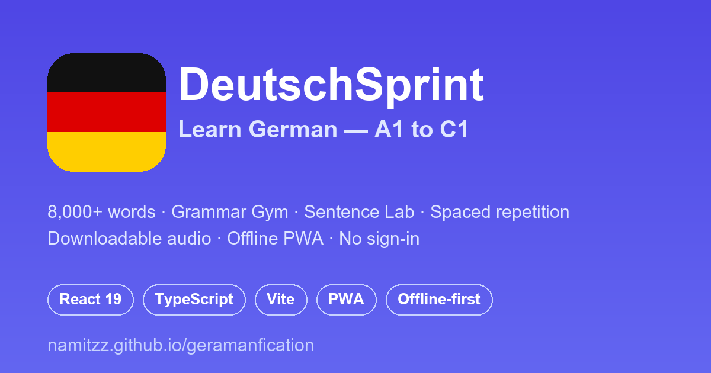

# 🇩🇪 DeutschSprint — Learn German (A1–C1), Offline

A fast, mobile-first **Progressive Web App** for learning German — from beginner (A1) to advanced (C1). Practice by **doing**, not reading: interactive vocabulary, grammar drills, sentence building, listening dictation, spaced repetition, and **downloadable audio**. Free, offline-first, and no sign-in.

**▶ Live demo: https://namitzz.github.io/geramanfication/**



## ✨ Features

- **📚 8,000+ words (A1–C1)** — CEFR-leveled vocabulary, ordered by frequency
- **🏋️ Grammar Gym** — learn 365 grammar rules through gamified quizzes (match rule ↔ meaning, spot the example) instead of walls of text
- **🧪 Sentence Lab** — practice 2,300 real sentences three ways: **build** the word order, **listen & type** (dictation), or **translate**
- **🎴 Flashcards + quizzes** — flip cards, multiple-choice, and typo-tolerant type-in
- **🎯 Spaced repetition** — Leitner 5-box system for efficient review
- **🎮 Gamification** — XP, levels, and a daily streak across every mode
- **🔊 German audio** — Web Speech pronunciation **plus downloadable audio packs** (real MP3s, female neural voice)
- **📱 Offline PWA** — installable, works with no connection, data stored locally
- **🌙 Dark mode & ♿ accessibility** — keyboard nav, ARIA labels, dyslexic-friendly font

## 🧩 How it works

Content is imported **at build time** from a German-language API into bundled JSON — so the app stays fully offline with no runtime API calls or keys.

- `npm run content:fetch` — import vocabulary, grammar, and sentences
- `npm run audio:generate` — pre-generate MP3 audio packs (Microsoft Edge neural voice)

Low-quality source entries (Wiktionary-style grammatical labels rather than translations) are filtered out so quiz answers are always meaningful.

## 📦 Tech stack

React 19 · TypeScript · Vite · Tailwind CSS · Zustand · React Router · Recharts · Lucide · vite-plugin-pwa (Workbox) · Vitest · ESLint/Prettier

## 🚀 Getting started

```bash
git clone https://github.com/namitzz/geramanfication.git
cd geramanfication
npm install
npm run dev        # http://localhost:5173/geramanfication/
```

```bash
npm run build      # type-check + production build
npm run test       # unit tests (Vitest)
npm run lint       # ESLint
```

## 🎯 Spaced repetition (Leitner)

Cards move up a box on a correct answer and reset to Box 1 on a miss:

| Box | Next review |
| --- | ----------- |
| 1 | tomorrow |
| 2 | 3 days |
| 3 | 1 week |
| 4 | 2 weeks |
| 5 | 1 month (mastered) |

## 🚢 Deployment

Auto-deploys to **GitHub Pages** via GitHub Actions on every push to `main` (lint → test → build → deploy).

## 📄 License

MIT — open source and free to use.

---

**Made with ❤️ for German learners.**
